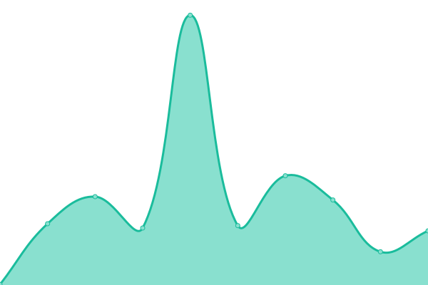
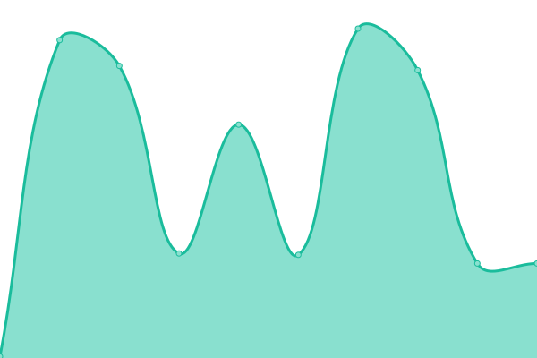
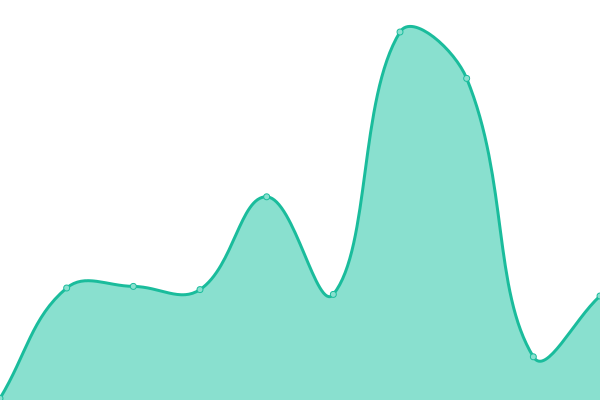
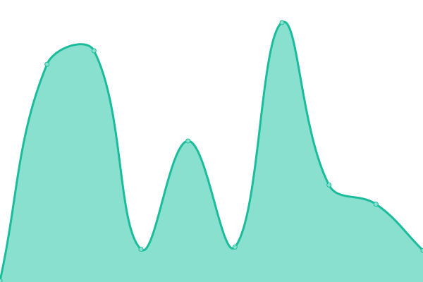
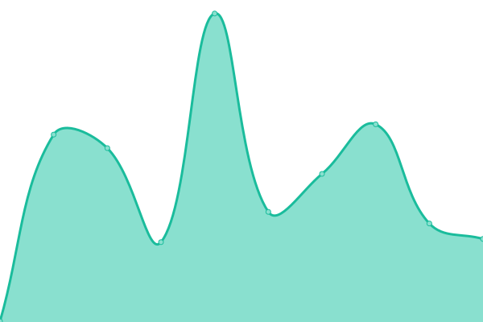
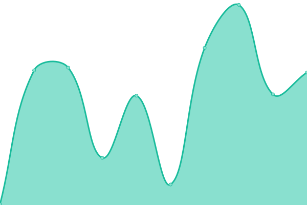

# [📈 Live Status](https://NASA-IMPACT.github.io/csdap-status): <!--live status--> **🟧 Partial outage**

This repository contains the open-source uptime monitor and status page for [Inter Agency Implementation and Advanced Concepts](https://NASA-IMPACT.github.io/csdap-status), powered by [Upptime](https://github.com/upptime/upptime).

With [Upptime](https://upptime.js.org), you can get your own unlimited and free uptime monitor and status page, powered entirely by a GitHub repository. We use [Issues](https://github.com/NASA-IMPACT/csdap-status/issues) as incident reports, [Actions](https://github.com/NASA-IMPACT/csdap-status/actions) as uptime monitors, and [Pages](https://NASA-IMPACT.github.io/csdap-status) for the status page.

<!--start: status pages-->
<!-- This summary is generated by Upptime (https://github.com/upptime/upptime) -->
<!-- Do not edit this manually, your changes will be overwritten -->
<!-- prettier-ignore -->
| URL | Status | History | Response Time | Uptime |
| --- | ------ | ------- | ------------- | ------ |
|  [Smallsat Data Explorer (SDX)](https://csdap.earthdata.nasa.gov) | 🟩 Up | [smallsat-data-explorer-sdx.yml](https://github.com/NASA-IMPACT/csdap-status/commits/HEAD/history/smallsat-data-explorer-sdx.yml) | 

 142ms
     
 | 

<a href="https://NASA-IMPACT.github.io/csdap-status/history/smallsat-data-explorer-sdx">100.00%</a>
    

|  [STAC API](https://csdap.earthdata.nasa.gov/stac/_mgmt/ping) | 🟩 Up | [stac-api.yml](https://github.com/NASA-IMPACT/csdap-status/commits/HEAD/history/stac-api.yml) | 

 120ms
     
 | 

<a href="https://NASA-IMPACT.github.io/csdap-status/history/stac-api">100.00%</a>
    

|  [Orders API - Server](https://csdap.earthdata.nasa.gov/api/v1/health/server) | 🟩 Up | [orders-api-server.yml](https://github.com/NASA-IMPACT/csdap-status/commits/HEAD/history/orders-api-server.yml) | 

 61ms
     
 | 

<a href="https://NASA-IMPACT.github.io/csdap-status/history/orders-api-server">100.00%</a>
    

|  [Orders API - Database](https://csdap.earthdata.nasa.gov/api/v1/health/db) | 🟩 Up | [orders-api-database.yml](https://github.com/NASA-IMPACT/csdap-status/commits/HEAD/history/orders-api-database.yml) | 

 111ms
     
 | 

<a href="https://NASA-IMPACT.github.io/csdap-status/history/orders-api-database">100.00%</a>
    

|  [Orders API - Data](https://csdap.earthdata.nasa.gov/api/v1/health/data) | 🟩 Up | [orders-api-data.yml](https://github.com/NASA-IMPACT/csdap-status/commits/HEAD/history/orders-api-data.yml) | 

 184ms
     
 | 

<a href="https://NASA-IMPACT.github.io/csdap-status/history/orders-api-data">100.00%</a>
    

|  [Data Authorization System](https://csdap.earthdata.nasa.gov/signup) | 🟥 Down | [data-authorization-system.yml](https://github.com/NASA-IMPACT/csdap-status/commits/HEAD/history/data-authorization-system.yml) | 

 98ms
     
 | 

<a href="https://NASA-IMPACT.github.io/csdap-status/history/data-authorization-system">0.00%</a>
    

<!--end: status pages-->

[**Visit our status website →**](https://NASA-IMPACT.github.io/csdap-status)

## 📄 License

- Powered by: [Upptime](https://github.com/upptime/upptime)
- Code: [MIT](./LICENSE) © [Anand Chowdhary](https://anandchowdhary.com), supported by [Pabio](https://pabio.com)
- Data in the `./history` directory: [Open Database License](https://opendatacommons.org/licenses/odbl/1-0/)
